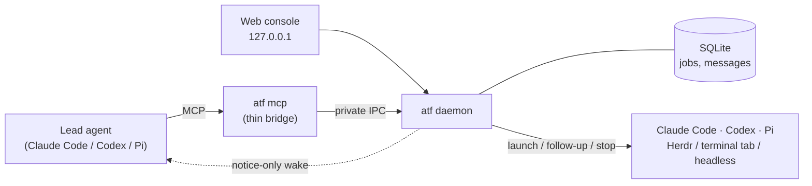

# AgentTeamForge

**Run teams of coding agents as durable jobs on your own machine.**

AgentTeamForge (`atf`) is a small local daemon that lets one agent lead a team
of others. Your lead — a Claude Code, Codex or Pi session — hands out work
through MCP; the daemon launches the Claude Code, Codex and Pi agents that do
it, tracks every job in SQLite and wakes the lead when results are ready.

The daemon owns the work, not the lead. If your lead session crashes, you close
the terminal or the MCP bridge dies, accepted jobs keep running and their
results are waiting when you reconnect.


<sub>The operator console with a demo team: two agents running, two finished,
one cancelled and one needing attention.</sub>

## Why

Coding agents are good at delegating to each other, but the plumbing is
fragile: sub-agents die with their parent, results get lost when a session
restarts, and you can't see what a background agent is doing. AgentTeamForge
puts one durable process between the lead and its team:

- **Accepted work survives.** A job is committed to SQLite before `submit_job`
  returns. A crashed lead or bridge doesn't cancel it; a restarted daemon
  reconciles what was running instead of guessing.
- **Real agents, your way.** Agents run as real CLI sessions — visible,
  interactive TUIs you can type into, or headless background processes. You
  choose once at setup; ATF never silently switches modes.
- **The lead doesn't poll.** When a job finishes, the result is stored first,
  then the lead gets a short notice through its host's native session wake.
- **You can see and steer everything** from a small web console on loopback.

## Features

- **Three backends:** Claude Code, Codex and Pi, all with launch, follow-up,
  status/result, stop and recovery through the same MCP tools.
- **Follow-ups resume the native session.** `follow_up` continues the same
  Claude/Codex/Pi conversation in the same working directory; `interrupt`
  cancels a busy turn and sends the new prompt.
- **Interactive or headless.** Herdr panes on Linux, Windows Terminal tabs on
  Windows, Terminal.app or kitty on macOS — or headless background processes.
- **Parallel jobs** (eight at a time by default), optional per-job **git
  worktrees**, run timeouts and queue TTLs.
- **Capability tiers** (`cheapest` … `max`) for Codex and Pi, mapped to models
  and effort levels you can change in the console.
- **External members:** a lead can issue a ten-minute join ticket so a
  manually started Claude Desktop or Codex Desktop session joins the team and
  exchanges messages with it.
- **Web console:** authenticated, loopback-only, text-only. Live cards per lead
  and agent, streamed activity, inline follow-up, interrupt and stop, a New
  agent form, and tier settings.
- **Housekeeping:** `atf doctor`, automatic pruning of old jobs, optional login
  autostart, checksum-verified install, upgrade and clean uninstall.
- **Local by default.** No cloud service is contacted unless you opt in.

## Platform status

| Platform | Status |
| --- | --- |
| **Linux x64** (glibc) | Primary platform. Verified end to end with real agents, headless and Herdr. |
| **Windows x64** | Verified on Windows 11 for the v0.0.1 test items (named pipes across elevation levels, Windows Terminal launch, stop, slow starts). Fixes for the failures found there are in v0.0.2; the re-test is pending. |
| **macOS arm64** | Release bundle built, untested. Testers welcome. |

Linux arm64 and musl are not supported.

## Install

Latest release: **[v0.0.2](https://github.com/PRFactory-app/agent-team-forge/releases/tag/v0.0.2)**.

```sh
curl -fsSL https://github.com/PRFactory-app/agent-team-forge/releases/latest/download/install.sh | sh
```

The installer downloads the archive for your platform, checks it against the
release's SHA-256 sums and installs `atf` to `~/.local/bin`. It does not edit
your shell profile. See [Install and startup](docs/install.md) for pinning a
version, upgrades, autostart and uninstall.

You also need at least one agent CLI installed and logged in:
[Claude Code](https://docs.anthropic.com/claude-code), Codex or Pi.

## Quickstart

**1. Set up.** Pick how agents are launched:

```sh
~/.local/bin/atf setup --mode herdr     # visible, interactive agents (Linux, needs Herdr)
~/.local/bin/atf setup --mode headless  # background agents
```

Setup registers the MCP server with every installed client (Claude Code, Codex,
Pi) and enables Claude Code's cross-session inbox for wake notices. Run
`atf setup` with no mode in a terminal to be asked. Then reload your agent
clients. `atf doctor` checks the result. The daemon starts on first use.

**2. Open the console.**

```sh
~/.local/bin/atf web --open
```

**3. Delegate from a lead.** In a Claude Code (or Codex, or Pi) session, ask it
to use the `agentteamforge` tools — or call them directly:

```text
submit_job(backend="codex", model="high", instruction="Review the diff on this branch for bugs", idempotency_key="review-1")
submit_job(backend="claude", instruction="Write integration tests for the refund endpoint", cwd="/path/to/repo", worktree=true, idempotency_key="tests-1")
```

The lead gets a wake notice when each job finishes, then reads the result with
`get_job`. Continue a job's conversation with `follow_up`, list the team with
`list_jobs`, and cancel with `stop_job`. The [Linux quickstart](docs/quickstart.md)
covers every tool, the CLI equivalents (`atf client …`), wake setup per host and
joining Desktop sessions.

## How it works



- Each lead talks to the daemon through `atf mcp`, a thin stdio bridge. The
  bridge holds no state; if it dies, a new one picks up the same lead session.
- One daemon per user runs the jobs. It stores jobs, messages and delivery
  state in SQLite and keeps logs and worktrees as files in a private state
  directory (`~/.local/state/agentteamforge`).
- When a job ends, the daemon commits the result, then sends the lead a
  notice-only wake: "job X finished, call `get_job`". The notice carries no
  result, so a lost notice loses nothing — `list_jobs` always has the truth.
- If the daemon itself restarts, it reconciles jobs that were running. When it
  can't prove what happened to an agent, the job is marked
  `needs_reconciliation` instead of being run twice.

More detail: [architecture](docs/architecture.md),
[launch modes and terminals](docs/terminal-modes.md),
[web console](docs/web-console.md), [tier settings](docs/settings.md),
[migrating from win-agent-teams](docs/migrating-from-win-agent-teams.md).

## Opt-in: PRFactory for human teams

AgentTeamForge works fully on its own. If your team uses
PRFactory, ATF can also act as a local
worker for it, so tasks that people on your team create and assign in
PRFactory are carried out by your agent team — without a separate tracker such
as Jira in between.

```sh
atf prfactory connect --url https://<your-prfactory-server> \
  --repo <REPOSITORY_ID>=/path/to/local/checkout   # worker token is read from stdin
atf prfactory status
atf prfactory disconnect
```

What the connector does today:

- **Outbound only.** The daemon polls PRFactory over HTTPS with a
  repository-scoped worker token stored privately in the state directory. No
  inbound port or tunnel. It is off until you run `connect`, and a rejected
  token stops remote intake without touching local jobs.
- **Tasks become durable team runs.** A claimed work item is recorded locally
  before anything runs, then its lead and team members (from PRFactory's team
  recipe, with backend, model, effort and concurrency limits) are submitted as
  ordinary ATF jobs in the mapped checkout. A retry never starts a member twice.
- **Results flow back.** When the team finishes, ATF uploads the expected
  output file as an artefact and completes or fails the work item with the
  result.
- **People can bring their own Desktop session.** A recipe member can be a
  manually started Claude Desktop or Codex Desktop session: `atf prfactory status`
  prints its private join prompt. Messages sent to that member from PRFactory
  are delivered to it, and its replies are uploaded to the work item's stream.
- **Disconnects are safe.** Accepted work stays with ATF. If PRFactory's
  ownership of an item can't be confirmed, ATF keeps the local results and
  holds back publication rather than running the work twice.

Status: unit- and scenario-tested; not yet accepted against a hosted PRFactory
server. Limits today: one repository per work item. **Planned:** follow-up and
stop commands from PRFactory for ATF-managed members, and live log/status
streaming for them. The design is in [the connector plan](docs/plans/prfactory-connector.md).

## Status

AgentTeamForge is early (v0.0.x) and moving quickly. Linux is where it is used
daily. [Project status](docs/project-status.html) tracks what is verified and
what is next; [docs/reports](docs/reports/) holds test reports.

## Contributing

The project is .NET 11 (C#), built by a small team of humans and agents. See
[CONTRIBUTING.md](CONTRIBUTING.md) for building from source, running the test
gates, the repository layout and how changes are planned and reviewed.
