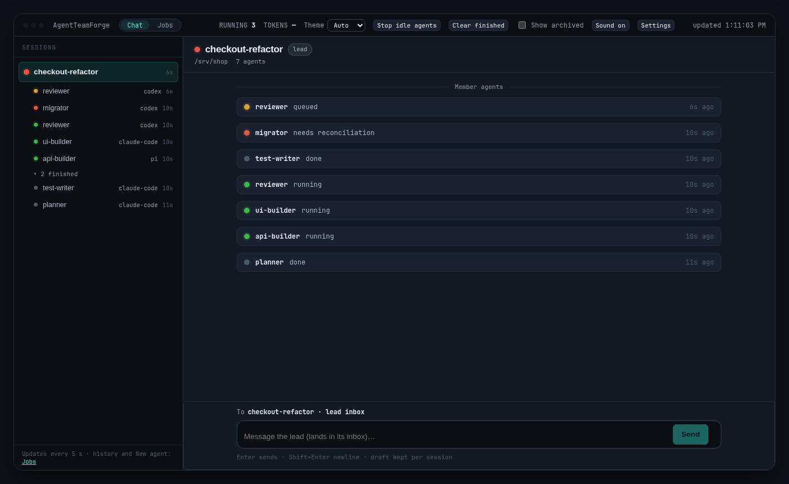

# AgentTeamForge

**Let your lead coding agent hand work to a team of Claude Code, Codex and Pi
agents — and keep that work alive when things crash.**

AgentTeamForge (`atf`) is a small local daemon. Your lead agent gives it jobs
over MCP; it runs the agents, remembers every job, and tells the lead when
results are ready. Close the lead, lose the terminal or restart your
session — the team keeps working. Watch the agents live in Herdr or terminal
tabs, or in a small web console.

**Free forever.** Working with a human team? Connect ATF to
[PRFactory](https://app.prfactory.dev), its optional paid companion.



## Quickstart

**1. Install** the [latest release](https://github.com/PRFactory-app/agent-team-forge/releases):

```sh
curl -fsSL https://github.com/PRFactory-app/agent-team-forge/releases/latest/download/install.sh | sh
```

Windows PowerShell 5.1 or newer (Windows x64 tester build):

```powershell
irm https://github.com/PRFactory-app/agent-team-forge/releases/latest/download/install.ps1 | iex
```

**2. Set up.** Choose visible agents (Herdr) or background agents (headless):

```sh
~/.local/bin/atf setup --mode herdr      # or: --mode headless
```

On Windows, open a new PowerShell window and run `atf setup --mode wt`.

This connects `atf` to the Claude Code, Codex and Pi clients you have installed.
Reload them afterwards. `atf doctor` checks everything.

**3. Hand out work.** In your lead session, just ask — for example
*"use agentteamforge to have Codex review this branch while Claude writes the
tests"* — or call the tools directly:

```text
submit_job(backend="codex", instruction="Review this branch for bugs", idempotency_key="review-1")
```

The lead is notified when the job finishes. Run `atf web --open` to watch the
team. More in the [quickstart guide](docs/quickstart.md).

## How it works

- Your lead talks to `atf` through MCP; one daemon per user runs all jobs.
- Every job is saved to a local SQLite database before it starts, so a crashed
  lead or bridge never loses it.
- Agents run as real CLI sessions: interactive in Herdr or terminal tabs, or
  headless in the background — your choice at setup, never switched silently.
- When a job finishes, the result is stored first, then the lead gets a short
  wake-up notice through its own session.
- Follow-ups continue the same agent conversation; you can interrupt or stop
  any job.
- Everything runs locally; there is no ATF cloud service, and any external
  connection is opt-in.

## Features

- Claude Code, Codex and Pi as team members, with model and effort choices
- Parallel jobs, optional git worktree per job, timeouts
- Visible, interactive agents you can type into — or headless
- Web console on localhost: live activity, follow-ups, stop, new agents, model tiers
- Claude Desktop or Codex Desktop can join a team with a one-time ticket
- Checksum-verified install, upgrade and uninstall; optional start at login

## Platform status

- **Linux x64:** tested end to end with real agents.
- **Windows x64:** being tested (Windows Terminal tabs).
- **macOS arm64:** release built, untested — testers welcome.

## Working with a human team? → PRFactory

AgentTeamForge is free forever and works fully on its own. When people on your
team want to hand out work too, [PRFactory](https://app.prfactory.dev) is the
optional paid companion that replaces Jira for this. Tasks your colleagues
create and assign in PRFactory are picked up by your ATF agent team, and the
results are posted back to the task. The connector is opt-in and off until you
run `atf prfactory connect`.

## Learn more

- [Quickstart guide](docs/quickstart.md) and [install, upgrade, uninstall](docs/install.md)
- [Launch modes](docs/terminal-modes.md), [web console](docs/web-console.md), [model tiers](docs/settings.md)
- [Architecture](docs/architecture.md) and [project status](docs/project-status.html)
- [Contributing](CONTRIBUTING.md) — building from source, tests and how changes are made
