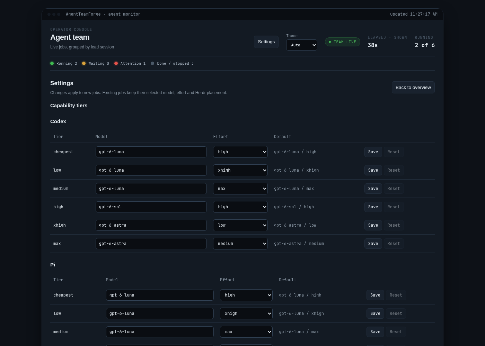

# Web console

The daemon serves a small operator console (no HTML from agents) in every launch mode:
live activity, results, follow-ups, stop, new agents, join tickets and model
tiers. Decision record: [ADR 0010](adr/0010-minimal-loopback-web-console.md).


## Open it

```sh
atf web          # print the link
atf web --open   # open it in the default browser
```

Add `--state-dir DIR` for a custom state directory. The console listens on
`127.0.0.1:8765`. To change the port, rerun setup with your launch mode, for
example `atf setup --mode headless --web-port 8766`, then restart the daemon.
If the port is taken, the daemon logs that the console is unavailable and
keeps serving jobs.

The link carries the console token in a `#token=...` fragment. The page keeps
it in that tab's session storage and removes it from the address bar.
`atf web --rotate-token` revokes old links and prints a new one.

## Use it

- **Teams.** Each lead session has a collapsible group for its jobs and joined
  external members. PRFactory jobs have their own group. The header shows
  running, waiting and failed counts; the browser remembers which groups you
  opened or closed.
- **Cards.** Each lead session and agent has a card with a one-line preview of
  the latest activity. Click a card (Escape to close) to see its composer,
  result and live activity transcript. **Raw logs** shows the full output
  stream. An absent result is shown differently from an empty one.
- **Follow-up.** Type in the card's composer; Enter sends, Shift+Enter adds a
  newline. A message to a running agent queues behind its current turn, as
  `atf client follow-up` and MCP `follow_up` do; check **Interrupt** to
  replace the running turn instead. A lead card lets you
  choose which of its member agents to message; the lead itself is an MCP
  binding, not a managed agent.
- **Stop.** **Stop job** cancels a queued or running job. In interactive
  modes a finished turn leaves its tab idle for follow-ups; **Stop agent**
  closes that owned tab. Stopping asks for confirmation.
- **New agent.** Submit a prompt to a configured Claude Code, Codex or Pi
  backend with an existing absolute working directory and, optionally, model,
  effort and lead session. The model and effort lists come from the daemon's
  catalog. The console and the daemon validate the directory and options
  before accepting the job; a rejection names the field at fault.
- **Join ticket.** Expand a lead card to create a ten-minute join ticket for a
  Claude Desktop or Codex Desktop external member and copy the `join_team`
  instructions into that session ([usage](usage.md#external-members)).
- **History.** All jobs still retained (30-day prune window) with status
  filters and paging.

## Model tiers



**Settings** changes the model and effort behind each Codex or Pi capability
tier. Defaults are built in; changed tiers are stored owner-only in
`<state>/tier-map.json` (replaced atomically). Reset a row or all rows to
remove overrides.

- The daemon resolves a tier when it accepts a job. Existing jobs, and
  follow-ups that inherit their parent's selection, keep their stored model
  and effort. A follow-up that names a tier uses the current mapping.
- When the daemon has a cached model catalog from the backend CLI, Settings
  offers a dropdown and rejects unavailable models with a CLI upgrade hint.
  Otherwise enter a model slug; admission checks it once a catalog is known.
- The effort list is the one the daemon validates against. For Codex it is
  the reasoning levels the catalog reports for the row's model (so `ultra`
  is offered only where the model supports it); a rejected save marks the
  model or effort control and shows why.
- Settings also holds the Herdr placement choice (own ATF session or an
  existing session).

API: `GET /api/settings/tiers` returns effective and default tables plus cached
catalogs. `PUT /api/settings/tiers` accepts
`{ "backend": "codex", "tier": "xhigh", "model": "…", "effort": "xhigh" }`;
omit `model` to reset one tier, or send `{ "reset_all": true }`.

A write rejected as invalid (`web_bad_request` from the console,
`invalid_request` from the daemon) returns HTTP 400 with `error_detail` and,
when one field is at fault, `field` (for example `"field": "effort"`). Other
daemon refusals, such as an unavailable model on submit, keep HTTP 200 with
`ok: false` and the reason in `error`.

## Security

- Binds numeric loopback only. Not intended for remote access.
- Every `/api/` call needs `Authorization: Bearer <token>`. The console token
  is random, separate from the daemon IPC credential, and stored owner-only in
  `web-console.key`.
- The exact `Host` header is required on every request (421 otherwise) and the
  exact `Origin` on writes (403 otherwise). No cookies, CORS or query-string
  credentials.
- Request bodies (512 KiB), instructions (64 KiB characters) and concurrent
  calls (4) are bounded. The daemon uses the same instruction limit.
- The console forwards every operation to the daemon over IPC. It never opens
  the database, never mints idempotency keys and never retries a mutation; an
  ambiguous outcome is shown as `outcome_unknown` with an explicit retry using
  the same key.
